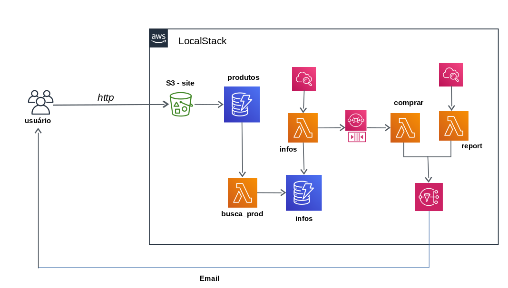
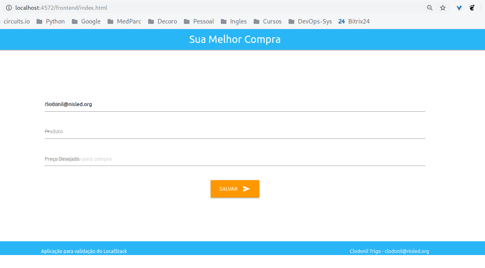
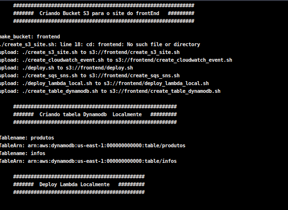
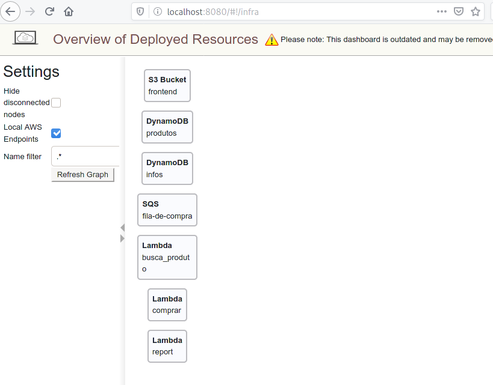

# Desenvolvendo para AWS usando SandBox Local

É muito comum nas empresas que adotam a cloud pública como AWS, pensarem em modelo para disponibilizarem recursos aos desenvolveres para aprendizado ou testes.

Algumas empresas utilizam como estratégia disponibilizar a mesmo conta produtiva para testes, separando os ambientes por VPCs ou Clusters.

Esse ambiente em constante mudança tende a degradar e, com o passar do tempo, a segregação dos ambientes não é respeitada, gerando grande risco à operação ou ao negócio.

Outras empresas liberaram uma nova conta AWS como SandBox. Aparentemente é uma boa ideia, entretanto alguns riscos estão envolvidos nesse processo.

Tais como:

* Apesar da conta ser usado para SandBox, é uma conta normal na AWS, podendo ser usado como `shadow IT`; tornando o ambiente de SandBox em ambiente produtivo; Esse risco é maior quando não é usado infraestrutura como código.

* Qualquer recurso instanciado é cobrado; Existe o risco de perder o controle do custo da conta; Uma chave de acesso vazada pode causar prejuízos enormes.

* Risco de usar dados produtivos no ambiente de SandBox.

Aqui, apresentamos uma terceira possibilidade... onde o desenvolvedor trabalha localmente e constrói a infraestrutura como código; interagindo diretamente com as API do provider de forma "mocada". Ganhando agilidade no desenvolvimento e toda a construção é realizada no computador do desenvolvedor.

Neste caso, não existe uma conta AWS e muito menos uma console AWS. Considerando que uma adoção de cloud pública envolve também adotar metodologias como infraestrutura como código, não faz muito sentido liberar a console AWS para os desenvolvedores (exceto para consulta e casos excepcionais).

O computador do desenvolver é o seu SandBox. Ele pode construir e destruir o ambiente quantas vezes forem necessárias, sem afetar outros projetos e sem custos.

Dessa forma os desenvolvedores passam a conhecer os recursos principais da AWS através de chamadas de API local e escrever a infraestrutura em código utilizando `Terraform` ou `Cloudformation`.

Após as validações locais, a solução e a sua codificação, pode ser enviada à AWS, bem como, o seu `deploy` via Pipeline.

Para validar localmente, vamos utilizar o `localstack`. Se você não conhece o `localstack`, preparei um [tutorial](https://github.com/clodonil/tutorial_localstack) com os principais recursos.

O `localstack` instância (localmente) os principais serviços AWS, possibilitando assim a criação de um SandBox para desenvolvimento e aprendizagem. Ele utiliza a mesma interface de API dos recursos AWS. O desenvolvedor não tem nenhum prejuízo e a experiência no desenvolvimento e a mesma se tivesse interagindo com a AWS.

O ciclo de desenvolvimento proposto é:

Após ter uma versão estável, o código é submetido ao git, que inicia a pipeline.

A pipeline vai realizar as seguintes etapas:

- Realizar o build da app;
- Validar o cloudformation criado;
- Validar o teste de integração usando o localstack;
- Realiza o deploy na AWS,

# Ambiente de Desenvolvimento proposto

Para validar uso do localstack como SandBox, foi proposto o desenvolvimento de uma aplicação bastante simples.



O usuário através do FrontEnd  cadastra um produto que deseja comprar e o preço desejado. Mediante a essa informação, é realizada uma pesquisa diária do produto no site do  `Mercado Livre` e registra os melhores preços.

Assim que obter o preço desejado, o produto é comprado (simulação de compra).

Para o desenvolvimento vamos utilizar os seguintes recursos AWS:

* **`S3`:** Hospedagem do FrontEnd do site;
* **`Lambda`:** Para scrapy no `Mercado Livre`;
* **`Dynamodb`:** Persistir o histórico de preços;
* **`SQS`:** Fila para acionar o lambda;
* **`SNS`:** Envio do reporte; 
* **`Cloudwatch Events`:** schedule para lambda;
* **`Parameter Store`:** Armazena ARN do SQS e SNS.

 
# Pontos observados durante o desenvolvimento

Durante o desenvolvimento do projeto foram obtidas algumas percepções que foram registradas como pontos positivos e negativos no uso do `localstack`.

 > Importante: todo o clico de desenvolvimento ocorreu naturalmente sem adaptações e como se estivesse trabalhando diretamente na AWS. Para os serviços suportados, a “emulação” das APIs é completa.

## Pontos Positivos:

  * Reset do ambiente assim que necessário, apenas reiniciar o container;
  * Chamadas usando o `AWS CLI` e SDK AWS;
  * Funcionalidades similares ao produto AWS;
  * Validar o programa chamado os Endpoint antes de fazer o deploy da lambda;
  * Dashboard do localstack

## Pontos Negativos:

  * Não existe uma padronização das regiões dos EndPoints;
  * SNS não envia e-mail externo para subscrição; Usei um SQS para validar;
  * Ter que manipular EndPoint local e AWS;

# Desenvolvimento

Para experimentar esse modelo, vamos propor o desenvolvimento de uma aplicação com os recursos AWS.

Aplicação é bastante simples, basicamente monitora o preço de um produto no site do `Mercado Livre` e após ficar abaixo de uma valor desejado, simula a compra.

O usuário acessa uma url e cadastra o nome do produto e o preço desejado. Recebe diariamente um reporte dos melhores preços.

Os recursos da AWS que serão utilizados:

* **`S3`:** Hospedagem do FrontEnd do site;
* **`Lambda`:** Para scrapy no `Mercado Livre`;
* **`Dynamodb`:** Persistir o histórico de preços;
* **`SQS`:** Fila para acionar o lambda;
* **`SNS`:** Envio do reporte; 
* **`Cloudwatch Events`:** schedule para lambda;
* **`Parameter Store`:** Armazena ARN do SQS e SNS.

## Preparando o ambiente para Desenvolvimento

No computador local, usando o `Docker` inicializamos o `localStack` com o seguinte comando.

```bash
$ docker run -it  -p 4567-4599:4567-4599 -p 8080:8080 localstack/localstack
```

Para facilitar a chamada dos EndPoint, criamos as seguintes variáveis de ambiente dos recursos que vamos utilizar durante o projeto.

```bash
# EndPoint do S3
export s3=http://localhost:4572

#EndPoint do Lambda
export lambda=http://localhost:4574

# EndPoint do SQS
export sqs=http://localhost:4576

# EndPoint do SNS
export sns=http://localhost:4575

# EndPoint do CloudWatch
export cloudwatch=http://localhost:4581

# EndPoint do Dynamodb
export dynamodb=http://localhost:4569

# EndPoint do CloudWatch Events
export events=http://localhost:4587

# EndPoint do DynamoDB Streams
export streams=http://localhost:4570
```

Também vamos precisar do `AWS CLI` instalado e configurado.

Para instalar vamos usar o seguinte comando:

```bash
$ pip install awscli

```

E para configurar vamos executar o comando `configure` e nos campos `ACCESS KEY` e `SECRET ACCESS KEY` pode preencher com qualquer conteúdo. Não vamos usar essas chaves.
 

```bash

$ aws configure
     AWS Access Key ID [None]: xxxxxx
     AWS Secret Access Key [None]: xxxxxx
     Default region name [None]: us-east-1
     Default output format [None]: json
```

## FrontEnd - S3

Vamos começar o desenvolvimento com o FrontEnd em `html` e `Javascript` que vai ficar hospedado no `S3`. O site está no diretório chamado `frontend`.

Para validar localmente o desenvolvimento do site, criamos um `Bucket` e fizemos o upload do código. Neste primeiro momento, vamos criar usando os comandos do `AWS CLI`, mais futuramente vamos criar o `CloudFormation` com toda a infraestrutura necessária.

Criando o Bucket com o nome `frontend`:

```bash
$ aws --endpoint-url=$s3 s3 mb s3://frontend
```

Vamos definir que esse site vai receber conteúdo de website:

```bash
$ aws --endpoint-url=$s3 s3 website s3://frontend --index-document index.html --error-document error.html
```
E para finalizar vamos copiar os arquivos do site para o bucket:

```bash
$ aws --endpoint-url=$s3 s3 cp .  s3://frontend/  --acl public-read --recursive
```
Vamos validar esse primeiro passo acessando o site de frontend.

http://localhost:4572/frontend/index.html




Os comandos acima foram sintetizados no script [create_s3_site.sh](https://github.com/clodonil/LocalStack_PoC/blob/master/scritps/create_s3_site.sh).


## DynamoDB

Com o site criado, vamos passar para o desenvolvimento das tabelas do DynamoDB e a conexão com os programas executadas pelas funções `lambda`.

A primeira tabela vamos chamar de `produtos`. Essa tabela vai receber o `input` realizado pelo site com o nome do produto que vai ser pesquisado e o preço desejado para compra e será complementado com os dados pesquisados.

Nessa fase, vamos criar a tabela usando o `AWS CLI`, em um segundo momento vamos utilizar o `CloudFormation` para subir a Infra.

```bash
$ aws --endpoint-url=$dynamodb dynamodb create-table --table-name produtos  \
      --attribute-definitions AttributeName=email,AttributeType=S AttributeName=produto,AttributeType=S \
      --key-schema AttributeName=email,KeyType=HASH AttributeName=produto,KeyType=RANGE \
      --provisioned-throughput ReadCapacityUnits=5,WriteCapacityUnits=5
```

A segunda tabela vamos chamar de `infos`. Essa tabela terá ligação com a primeira tabela através do `email`, e vamos armazenar os links pesquisados e informações sobre o produto.


```bash
$ aws --endpoint-url=$dynamodb dynamodb create-table --table-name infos  \
      --attribute-definitions AttributeName=email,AttributeType=S AttributeName=url,AttributeType=S  \
      --key-schema AttributeName=email,KeyType=HASH AttributeName=url,KeyType=RANGE  \
      --provisioned-throughput ReadCapacityUnits=5,WriteCapacityUnits=5
```

Os comandos acima foram sintetizados no script [create_table_dynamodb.sh](https://github.com/clodonil/LocalStack_PoC/blob/master/scritps/create_table_dynamodb.sh).

## Lambda

Para popular a segunda tabela vamos desenvolver uma função `lambda` que captura os dados do `Mercado Livre` e salva no `Dynamodb`.
 
Esse primeiro `lambda` só busca as URL dos produtos.

 > Em uma aplicação real, as URL pesquisadas deveriam ser aprovadas pelo usuário. Não faremos isso.


No diretório [`lambda_busca_prod`](https://raw.githubusercontent.com/clodonil/LocalStack_PoC/master/lambda_busca_prod/busca_produto.py) temos toda a estrutura da função `lambda`, não vou entrar em detalhes de programação aqui, de qualquer forma, o código está em `Python` utilizando o `Boto3`.

Para fazer o deploy da função `lambda` vamos criar um pacote com todos as dependências.

Vamos seguir o seguintes passos:

Para deploy na AWS vamos utilizar uma pipeline.

1. Crie o diretório package:

```bash
$ mkdir package
```
 
2. Instale todos as dependências utilizadas:

```bash
$ pip install --targget ./package -r requirements.txt
```

3. Copie o programa para o diretório package:

```bash
$ cp busca_produto.py package/
```

4. Crie o pacote com o zip:

```bash
$ zip -r9 function.zip package/.
```

Agora podemos realizar o deploy do `lambda` utilizando o `AWS CLI` localmente.

```bash
$ aws --endpoint-url=$lambda lambda create-function --function-name busca_produto \
      --zip-file fileb://function.zip --handler busca_produto.handler \
      --runtime python3.7 --role arn:aws:iam::000000000000:role/roles2-CopyLambdaDeploymentRole-UTTWQYRJH2VQ
```
Saída do comando acima:

```
{
    "FunctionName": "busca_produto",
    "FunctionArn": "arn:aws:lambda:us-east-1:000000000000:function:busca_produto",
    "Runtime": "python3.7",
    "Role": "arn:aws:iam::000000000000:role/roles2-CopyLambdaDeploymentRole-UTTWQYRJH2VQ",
    "Handler": "busca_produto.handler",
    "CodeSize": 15274279,
    "Description": "",
    "Timeout": 3,
    "LastModified": "2019-12-30T14:40:53.051+0000",
    "CodeSha256": "MFsm0m7DBlU7Fq8gaPOPPVbJUGe8GCGiUY7Jr2XY/9w=",
    "Version": "$LATEST",
    "TracingConfig": {
        "Mode": "PassThrough"
    },
    "RevisionId": "06b9be26-b015-46ea-9726-ab6bd89e000d"
}
```

Com o deploy realizada da função `lambda` podemos realizar uma chamada para executar e certificar que a `lambda` funciona corretamente.


```bash
$ aws --endpoint-url=$lambda lambda invoke --function-name busca_produto --payload '{}' saida.txt
```

Após a execução da `lambda` podemos olhar no `dynamodb` e certificar que os dados foram gravados corretamente.

```bash
$ aws --endpoint-url=$dynamodb dynamodb scan --table-name produtos  --return-consumed-capacity TOTAL
$ aws --endpoint-url=$dynamodb dynamodb scan --table-name infos  --return-consumed-capacity TOTAL
```

Agora vamos criar uma segunda função em `lambda` que vai pegar as urls cadastradas e obter as informações como preço do produto.

Essa função em `lamdba` vai seguir as seguintes etapas:

* Obter a lista dos produtos ativos na tabela `produtos` do dynamodb;
* Obter as urls ativas na tabela `infos`;
* Obter as informações do produto no Mercado Livre;
* Gravar na tabela info as informações obtidas;
* Atualizar a tabela `produto` com o preço min e max.

Essa lambda está no diretório [`lambda_getinfo`](https://raw.githubusercontent.com/clodonil/LocalStack_PoC/master/lambda_getinfo/getinfo.py), utilizamos o mesmo procedimento da primeira `lambda` para realizar o deploy.

A terceira função `lambda` gera um relatório com os preços dos produtos. Essa função `lambda` está no diretório  [`lambda_report`](https://raw.githubusercontent.com/clodonil/LocalStack_PoC/master/lambda_report/report.py).

E a última função `lambda` simula a compra do produto se estiver abaixo ou igual ao preço desejado. Essa função está no diretório [`lambda_comprar`](https://raw.githubusercontent.com/clodonil/LocalStack_PoC/master/lambda_comprar/comprar.py).

 Nessa fase realizamos o deploy de todas as funções `lambda`. No arquivo [`deploy_lambda_local.sh`](https://github.com/clodonil/LocalStack_PoC/blob/master/scritps/deploy_lambda_local.sh) estão todos os comandos utilizados.

Utilizando o `AWS CLI`, podemos listar todas as `lambdas` provisionadas localmente:

```bash
$ aws --endpoint-url=$lambda lambda list-functions

```

# SQS e SNS

Uma vez por dia, é enviado um relatório para o e-mail cadastrado com o produto pesquisado e o menor e maior valor pesquisado. A criação do tópico foi realizado pelo `AWS CLI`.

```bash
$ aws --endpoint-url=$sns sns create-topic --name reports
```

A subscrição do e-mail ao tópico é realizado pela `lambda_busca_prod`. 

A comunicação entre a `lambda` info que busca os melhores preços e a `lambda` que realiza a compra do produto, é feita utilizando a lista `SQS`.

```bash
$ aws --endpoint-url=$sqs sqs create-queue --queue-name fila-de-compra
```

O script que cria o [`create_sqs_sns.sh`](https://github.com/clodonil/LocalStack_PoC/blob/master/scritps/create_sqs_sns.sh).

# CloudWatch Event


## Enviando relatório de itens pesquisados e valores


```bash
$ aws --endpoint-url=$events events put-rule --name 'DailyRuleReport' --schedule-expression 'rate(1 day)'

$ aws --endpoint-url=$lambda lambda add-permission --function-name report --statement-id StartReport \
      --action 'lambda:InvokeFunction' --principal events.amazonaws.com \
      --source-arn arn:aws:events:us-west-2:111111111111:rule/DailyRuleReport

$ aws --endpoint-url=$events events put-targets --rule DailyRuleReport 
      --targets '{"Id" : "1", "Arn": "arn:aws:lambda:us-east-1:000000000000:function:report"}'
```
 
## Buscando informações sobre os produtos

 
```bash
$ aws --endpoint-url=$events events put-rule --name 'ScrapyInfoProduto' --schedule-expression 'rate(1 day)'

$ aws --endpoint-url=$lambda lambda add-permission --function-name getinfo --statement-id StartScrapyInfoProduto \
      --action 'lambda:InvokeFunction' --principal events.amazonaws.com \
      --source-arn arn:aws:events:us-west-2:111111111111:rule/ScrapyInfoProduto

$ aws --endpoint-url=$events events put-targets --rule ScrapyInfoProduto \
      --targets '{"Id" : "1", "Arn": "arn:aws:lambda:us-east-1:000000000000:function:getinfo"}'
```


[create_cloudwatch_event.sh](https://github.com/clodonil/LocalStack_PoC/blob/master/scritps/create_cloudwatch_event.sh)

# Deploy Local

Todos os scripts utilizados são chamado pelo arquivo [deploy](https://github.com/clodonil/LocalStack_PoC/blob/master/scritps/deploy.sh) que provisiona todo o ambiente de forma rápida. 



Através de um dashboard simples, é possível acompanhar o provisionamento dos recursos:


